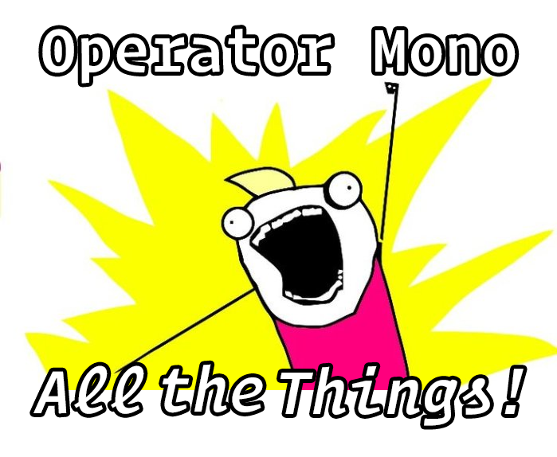
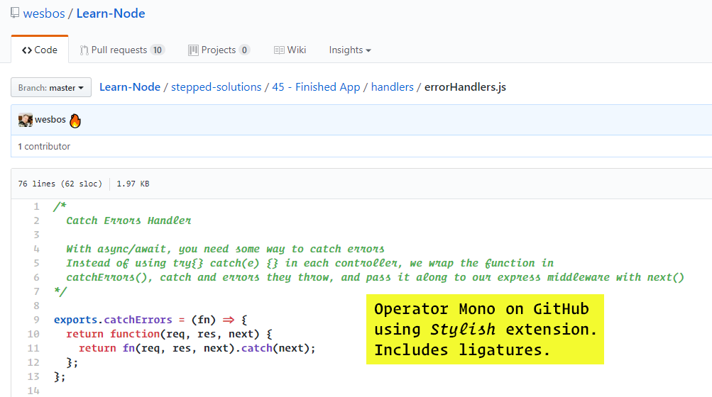
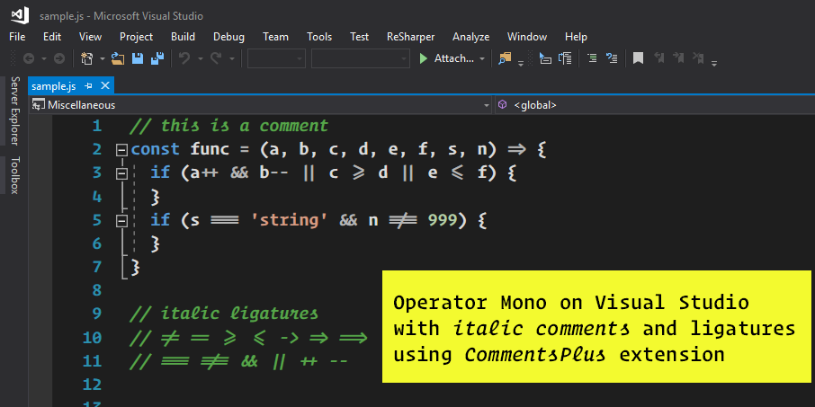

# Operator Mono Ligatures

This project will generate new OpenType fonts for [Operator Mono](https://www.typography.com/fonts/operator/styles/) that includes ligatures similar to
those found in the popular [Fira Code](https://github.com/tonsky/FiraCode) font.

These ligatures were custom created using [FontForge](http://fontforge.github.io/en-US/). 
There are even italic versions of the ligatures. 


>NOTE: Because *Operator Mono* is not a free font, you must have the original font files. This utility 
will merge the ligature definitions into a copy of the original font. The new font family is named *Operator Mono Lig* so you can install it side-by-side with the original font.

## Prerequisites
* The original *Operator Mono* font... of course.
* Install *fonttools* from https://github.com/fonttools/fonttools
  * Install Python
  * Run: `pip install fonttools`
* Node.js

## How to Install

Once all the prerequisites have been installed, clone this repo.

From the command line, run:

```
npm install
```

Copy your *Operator Mono* OpenType files into the `original` folder.

From the command line, run:

```
build
```

This will generate the new font files in the `build` folder. You can now install these fonts on your system.

---



## GitHub
Add *Operator Mono* to GitHub code blocks using the [Stylish Extension](https://chrome.google.com/webstore/detail/stylish-custom-themes-for/fjnbnpbmkenffdnngjfgmeleoegfcffe?hl=en).

Create a style and enter the following:

```css
.blob-code-inner, .blob-num, .highlight pre { font-family: "Operator Mono Lig" !important; font-size: 16px !important; }
.pl-c, .pl-e { font-style: italic; }
.pl-c { color: #4CAF50; }
```


## Visual Studio

You can have Visual Studio display the nice *Operator Mono* italic font for comments, using the [CommentsPlus Extension](https://marketplace.visualstudio.com/items?itemName=mhoumann.CommentsPlus).



## Hyper shell

Add *Operator Mono* to [Hyper](https://hyper.is/) a JS/CSS/HTML Terminal.


