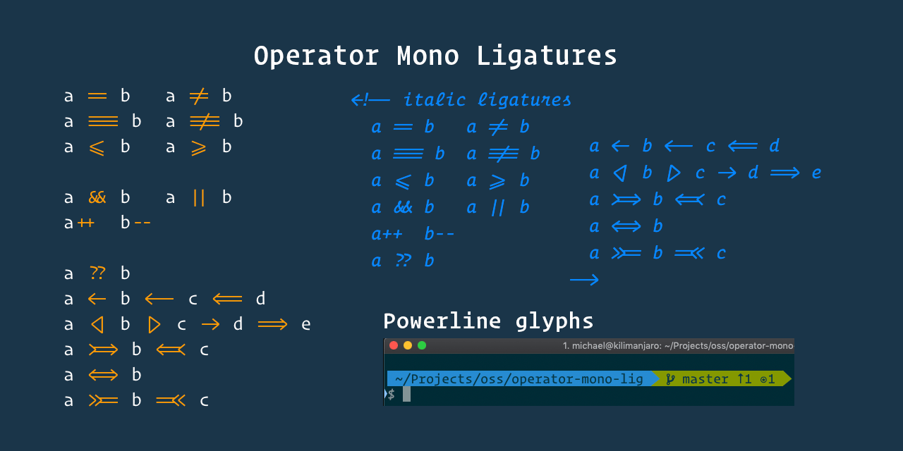
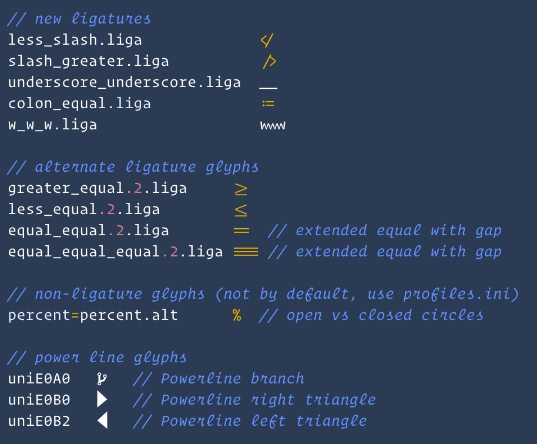

# Operator Mono Ligatures

[](#contributors-)



This project will generate new OpenType fonts for [Operator Mono](https://www.typography.com/fonts/operator/styles/) that includes ligatures similar to
those found in the popular [Fira Code](https://github.com/tonsky/FiraCode) font.

These ligatures were custom created using [Glyphs](https://glyphsapp.com/).
There are even italic versions of the ligatures.

## 🎉 What's New in Version 2



All new redesigned ligatures with better hinting. Updated font generation to support advanced OpenType features
like those found in Fira Code. For example, the cursor now moves inside the ligature. It also handles repeating
characters properly.


## 👀 <a href="https://htmlpreview.github.io/?https://github.com/kiliman/operator-mono-lig/blob/master/images/preview/normal/index.html">Click here to see preview images of all ligatures</a>

With the awesome help from [Mark Skelton](https://github.com/mskelton), we now have the full set of ligatures for
the following fonts. Thanks Mark, and thanks to all of you who have been patiently waiting for these ligatures to be completed.

- Operator Mono SSm Light/Light Italic
- Operator Mono SSm Book/Book Italic
- Operator Mono SSm Medium/Medium Italic
- Operator Mono SSm Bold/Bold Italic
- Operator Mono Light/Light Italic
- Operator Mono Book/Book Italic

## 🙏 Help Wanted

As noted above, v2 does not include all weights for Operator Mono. In order to update the other fonts, all the ligatures need to be redone. Unfortunately I just don't have the time to do that at the moment. If you have a Mac and are interested in helping, please let me know. I will even purchase a license to Gylphs Mini for you.

You can reach me at kiliman@gmail.com.

## ☑️ Take the poll

Which font weight of Operator Mono do you use? Also note difference between Screen Smart (SSm) and regular version. This will help prioritize the order of development.

[](https://api.gh-polls.com/poll/01C6T4C3FBG21KVS7FAW7Z09B2/Operator%20Mono%20SSm%20Book/vote)
[](https://api.gh-polls.com/poll/01C6T4C3FBG21KVS7FAW7Z09B2/Operator%20Mono%20SSm%20Medium/vote)
[](https://api.gh-polls.com/poll/01C6T4C3FBG21KVS7FAW7Z09B2/Operator%20Mono%20SSm%20Light/vote)
[](https://api.gh-polls.com/poll/01C6T4C3FBG21KVS7FAW7Z09B2/Operator%20Mono%20Book/vote)
[](https://api.gh-polls.com/poll/01C6T4C3FBG21KVS7FAW7Z09B2/Operator%20Mono%20Medium/vote)
[](https://api.gh-polls.com/poll/01C6T4C3FBG21KVS7FAW7Z09B2/Operator%20Mono%20Light/vote)

> NOTE: Because _Operator Mono_ is not a free font, you must have the original font files. This utility
> will merge the ligature definitions into a copy of the original font. The new font family is named _Operator Mono Lig_ so you can install it side-by-side with the original font.

## Prerequisites

- The original _Operator Mono_ font... of course.
- Python (v2.7+)
- Node.js
- Install _fonttools_ from https://github.com/fonttools/fonttools
  - Windows/Linux: `pip install fonttools`
  - Mac: `pip3 install fonttools`

## Installation

Once all the prerequisites have been installed, clone this repo or download latest release from [Releases](https://github.com/kiliman/operator-mono-lig/releases) and unzip.

Next, copy your _Operator Mono_ OpenType files into the `original` folder. **NOTE**: Filenames must not include spaces. It should look like:

- OperatorMonoSSm-Book.otf
- OperatorMonoSSm-BookItalic.otf
- OperatorMono-Light.otf
- OperatorMono-LightItalic.otf
- etc.

Finally, run the following commands to install npm dependencies and build the font files. The new font files will be placed in the `build` folder. You can now install these fonts on your system.

```sh
npm install

# Windows
build

# Linux/Mac
./build.sh
```

### Docker

If you use Docker, you can also use the executable Docker image [here](https://github.com/drod3763/kiliman-operator-mono-lig-docker). It handles all the prerequisite installation for you, you just need to:

1. Clone the repo [located here](https://github.com/drod3763/kiliman-operator-mono-lig-docker).
1. Copy your _Operator Mono_ OpenType files into the `input` folder.
1. From the command line run:
   ```sh
   docker-compose run --rm operator-mono-lig
   ```

The image will build and execute the conversion. The new font files will be generated into the `build` folder.

## Configure Your Code Editor

You can now select the newly generated font in your code editor. Make sure you enable font ligatures and set the desired font weight if using Windows. The code block below shows what this might look like if using VS Code.

```json
  "editor.fontFamily": "OperatorMonoSSmLig-Book",
  "editor.fontLigatures": true,
  // for Windows
  "editor.fontFamily": "Operator Mono SSm Lig",
  "editor.fontLigatures": true,
  "editor.fontWeight": "500",   // adjust for desired weight
```

## 🔧 Customize the generated font

By default, all available ligatures will be added to the generated font. However, if you don't like a particular
ligature, or would prefer to use an alternate glyph, you can create a `profiles.ini` file in the `./original` folder
to configure how the font should be built.

You can create one or more profiles. Each profile will have a set of directives. You can specify alternate glyphs for
a given ligature. You can also prevent a ligature from being added.

Each profile will be listed with `[profile name]` (the first profile should be named default). The generated font will
include the profile name. For example `[Go]` would generate the font: _Operator Mono Lig Go_. This way you can configure
a different set of ligatures for each language in your favorite code editor.

```ini
# name of profile (one or more sections, first should be name default)
[default]
# glyph=altglyph
greater_equal.liga=greater_equal.2.liga

# do not include glyph (add ! prefix)
!equal_equal.liga

# another optional section (will create a font named Operator Mono Lig Go)
[Go]
... add custom directives for this font ...
```

## 😍 Thank You

Thanks to Hoefler&Co for making such an amazing font. It makes writing code truly pleasurable.

Thanks also to all of you for your kinds words of encouragement and feedback. I really
appreciate it.

## ✨ Contributors

Thanks goes to these wonderful people ([emoji key](https://allcontributors.org/docs/en/emoji-key)):

<!-- ALL-CONTRIBUTORS-LIST:START - Do not remove or modify this section -->
<!-- prettier-ignore-start -->
<!-- markdownlint-disable -->
<table>
  <tr>
    <td align="center"><a href="https://github.com/kiliman"><br /><sub><b>Kiliman</b></sub></a><br /><a href="https://github.com/kiliman/operator-mono-lig/commits?author=kiliman" title="Code">💻</a> <a href="https://github.com/kiliman/operator-mono-lig/commits?author=kiliman" title="Documentation">📖</a> <a href="#design-kiliman" title="Design">🎨</a></td>
    <td align="center"><a href="https://github.com/mskelton"><br /><sub><b>Mark Skelton</b></sub></a><br /><a href="#design-mskelton" title="Design">🎨</a></td>
    <td align="center"><a href="https://github.com/drod3763"><br /><sub><b>Derick Rodriguez</b></sub></a><br /><a href="https://github.com/kiliman/operator-mono-lig/commits?author=drod3763" title="Documentation">📖</a></td>
    <td align="center"><a href="https://github.com/amitkparekh"><br /><sub><b>Amit Parekh</b></sub></a><br /><a href="https://github.com/kiliman/operator-mono-lig/commits?author=amitkparekh" title="Documentation">📖</a> <a href="#design-amitkparekh" title="Design">🎨</a></td>
    <td align="center"><a href="https://github.com/CandySunPlus"><br /><sub><b>NikSun</b></sub></a><br /><a href="#design-CandySunPlus" title="Design">🎨</a></td>
    <td align="center"><a href="https://github.com/Jakob6174"><br /><sub><b>Jakob Pearson</b></sub></a><br /><a href="https://github.com/kiliman/operator-mono-lig/commits?author=Jakob6174" title="Code">💻</a></td>
  </tr>
</table>

<!-- markdownlint-enable -->
<!-- prettier-ignore-end -->
<!-- ALL-CONTRIBUTORS-LIST:END -->

This project follows the [all-contributors](https://github.com/all-contributors/all-contributors) specification. Contributions of any kind welcome!
