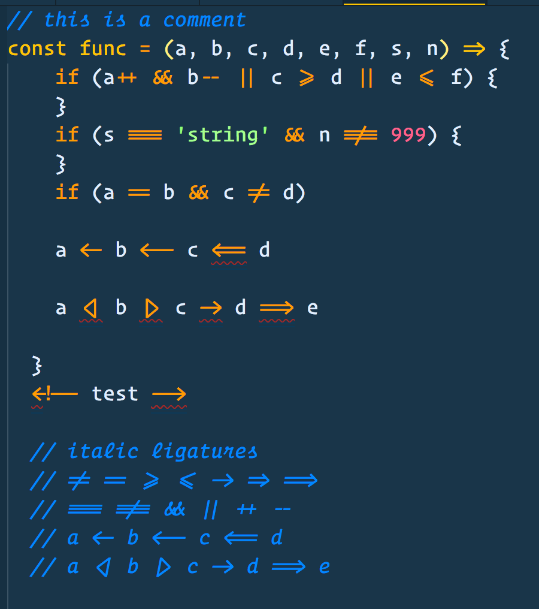
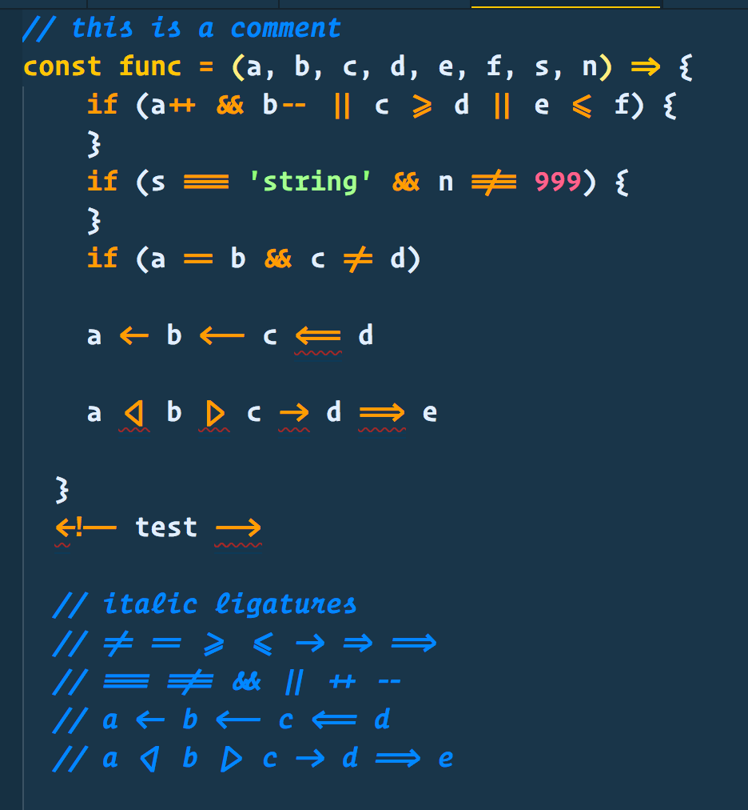

# Operator Mono Ligatures

This project will generate new OpenType fonts for [Operator Mono](https://www.typography.com/fonts/operator/styles/) that includes ligatures similar to
those found in the popular [Fira Code](https://github.com/tonsky/FiraCode) font.

These ligatures were custom created using [Glyphs](https://glyphsapp.com/). 
There are even italic versions of the ligatures. 

## Take the poll

Which font weight of Operator Mono do you use? Also note difference between Screen Smart (SSm) and regular version. This will help prioritize the order of development.

[](https://api.gh-polls.com/poll/01C6T4C3FBG21KVS7FAW7Z09B2/Operator%20Mono%20SSm%20Book/vote)
[](https://api.gh-polls.com/poll/01C6T4C3FBG21KVS7FAW7Z09B2/Operator%20Mono%20SSm%20Medium/vote)
[](https://api.gh-polls.com/poll/01C6T4C3FBG21KVS7FAW7Z09B2/Operator%20Mono%20SSm%20Light/vote)
[](https://api.gh-polls.com/poll/01C6T4C3FBG21KVS7FAW7Z09B2/Operator%20Mono%20Book/vote)
[](https://api.gh-polls.com/poll/01C6T4C3FBG21KVS7FAW7Z09B2/Operator%20Mono%20Medium/vote)
[](https://api.gh-polls.com/poll/01C6T4C3FBG21KVS7FAW7Z09B2/Operator%20Mono%20Light/vote)

I have updated the following fonts:

## ScreenSmart versions
* Operator Mono SSm Book
* Operator Mono SSm Book Italic
* Operator Mono SSm Medium
* Operator Mono SSm Medium Italic
* Operator Mono SSm Light
* Operator Mono SSm Light Italic (**coming soon**)

## Regular versions
* Operator Mono Book
* Operator Mono Book Italic
* Operator Mono Medium
* Operator Mono Medium Italic

**Operator Mono SSm Book**



**Operator Mono SSm Medium**



**Creating ligatures using Glyphs**


**YouTube video (click to view)**

[](https://youtu.be/ttI3W5Dh54E)

>NOTE: Because *Operator Mono* is not a free font, you must have the original font files. This utility 
will merge the ligature definitions into a copy of the original font. The new font family is named *Operator Mono Lig* so you can install it side-by-side with the original font.

## Prerequisites
* The original *Operator Mono* font... of course.
* Install *fonttools* from https://github.com/fonttools/fonttools
  * Install Python
  * Run: `pip install fonttools` (for Mac users it's better run `pip3 install fonttools` - [info](https://stackoverflow.com/a/33416270/3191011))
* Node.js (**version 7.6+ for async/await support**)

## How to Install

Once all the prerequisites have been installed, clone this repo.

From the command line, run:

```
npm install
```

Copy your *Operator Mono* OpenType files into the `original` folder.

From the command line, run:

### Windows

```
build
```

### Linux/Mac

```
./build.sh
```

This will generate the new font files in the `build` folder. You can now install these fonts on your system.

---


## GitHub
Add *Operator Mono* to GitHub code blocks using the [Stylish Extension](https://chrome.google.com/webstore/detail/stylish-custom-themes-for/fjnbnpbmkenffdnngjfgmeleoegfcffe?hl=en).

Create a style and enter the following:

```css
.blob-code-inner, .blob-num, .highlight pre { font-family: "Operator Mono Lig" !important; font-size: 16px !important; }
.pl-c, .pl-e { font-style: italic; }
.pl-c { color: #4CAF50; }
```


## Visual Studio

You can have Visual Studio display the nice *Operator Mono* italic font for comments, using the [CommentsPlus Extension](https://marketplace.visualstudio.com/items?itemName=mhoumann.CommentsPlus).


## Hyper shell

Add *Operator Mono* to [Hyper](https://hyper.is/) a JS/CSS/HTML Terminal.


