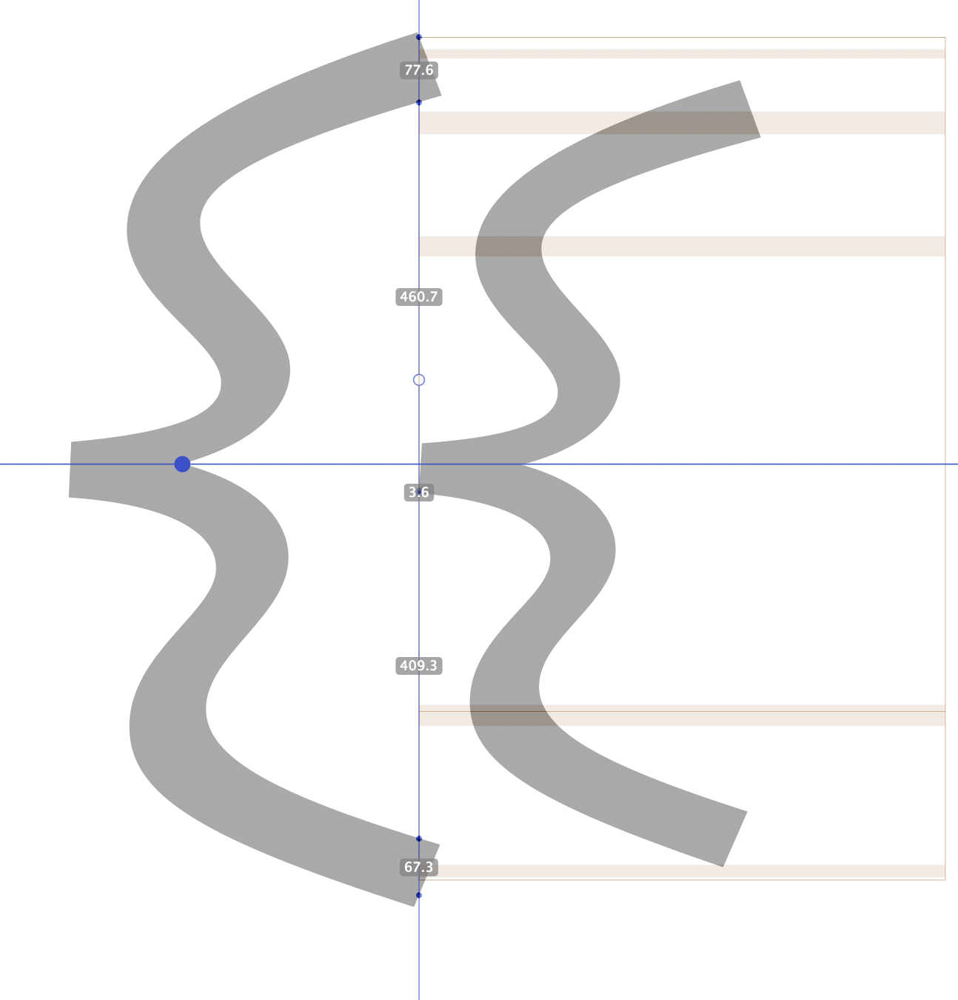

# Double-braces

## Creating the ligature \(Roman\)

1. 

For whichever brace is the "inner-brace", change the dimensions as so, changing only the size \(the `%` in the middle column\) and the rotation \(the right most setting\):

Move the left-most brace to the left and the right-most brace to the left so the top/bottom parts cross the middle guide and the numbers are like so:

Create a new guide  and move the guide so it intersects the pointy inner-corner of the larger brace

Move the smaller brace vertically \(up/down\) so the two pointy inner-corner bits cross like so:

## Creating the italic ligature

Repeat all the steps as above ligature above **BUT set the middle guide** **to**:

## Final ligatures

